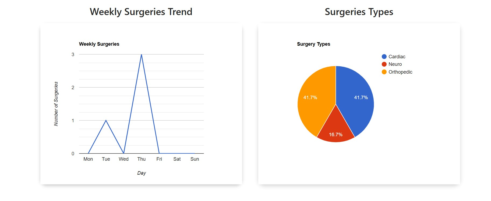
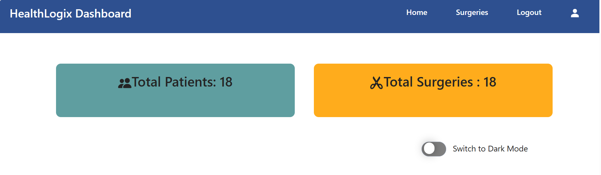
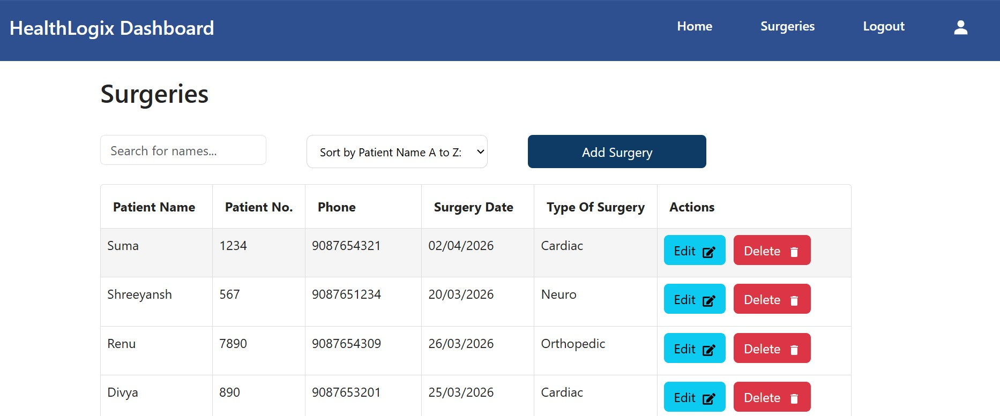
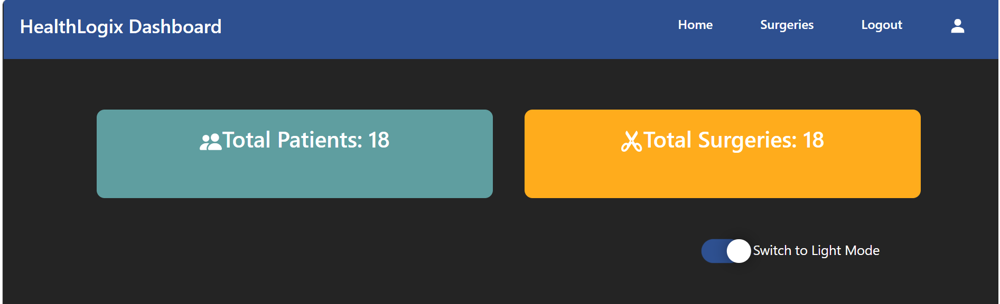

# 📊 HealthLogix – Surgery Analytics Dashboard

## 🚀 Overview

HealthLogix is a modern React-based analytics dashboard built to efficiently manage, monitor, and visualize data. It features secure authentication, interactive data visualizations, and real-time user interactions to deliver a seamless and responsive experience.

---

## ✨ Features

- 🔐 Authentication (Login / Logout)
- 📊 Interactive charts (Line & Pie)
- 📈 Dashboard cards (key metrics like surgeries & appointments)
- 📝 CRUD operations (Add / Edit / Delete)
- 🔍 Sorting and filtering functionality
- 🌗 Dark/Light theme toggle
- ⚡ Lazy loading for performance optimization
- 🔔 Toast notifications and alerts
- 📱 Fully responsive design (mobile, tablet, desktop)

---

## ⚡ Technical Highlights

- Implemented lazy loading to improve performance and reduce initial load time
- Used Context API for global state management (theme toggle)
- Integrated REST APIs with proper error handling and validation
- Designed reusable components for better scalability and maintainability

---

## 🛠️ Tech Stack

- React.js
- JavaScript (ES6+)
- HTML5 & CSS3
- React Router
- Context API
- Chart libraries (react-google-charts)

---

## 📂 Project Setup

git clone https://github.com/Shreejad123/healthlogix
cd healthlogix
npm install
npm start

## 📊 Screenshots

### 🌙 Dark Mode

